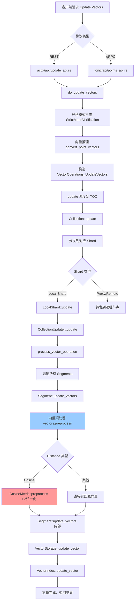
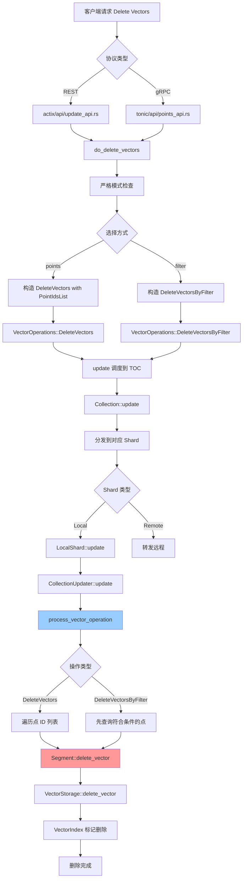

# Qdrant Delete & Update Vectors 流程详解

## 目录
- [1. API 定义](#1-api-定义)
- [2. Update Vectors 流程](#2-update-vectors-流程)
- [3. Delete Vectors 流程](#3-delete-vectors-流程)
- [4. 核心代码位置](#4-核心代码位置)

---

## 1. API 定义

### 1.1 Update Vectors API

#### REST API
- **端点**: `PUT /collections/{collection_name}/points/vectors`
- **实现**: `src/actix/api/update_api.rs::update_vectors()`

**请求体**:
```rust
pub struct UpdateVectors {
    pub points: Vec<PointVectors>,           // 要更新的点和向量
    pub shard_key: Option<ShardKeySelector>, // 分片键（可选）
    pub update_filter: Option<Filter>,       // 条件过滤器（可选）
}

pub struct PointVectors {
    pub id: PointIdType,      // 点 ID
    pub vector: VectorStruct, // 命名向量（可以是单个或多个）
}
```

#### gRPC API
- **服务**: `qdrant.Points/UpdateVectors`
- **实现**: `src/tonic/api/points_api.rs::update_vectors()`

**Proto 定义**:
```protobuf
message UpdatePointVectors {
  string collection_name = 1;
  optional bool wait = 2;
  repeated PointVectors points = 3;
  optional WriteOrdering ordering = 4;
  optional ShardKeySelector shard_key_selector = 5;
  optional Filter update_filter = 6;
}
```

---

### 1.2 Delete Vectors API

#### REST API
- **端点**: `POST /collections/{collection_name}/points/vectors/delete`
- **实现**: `src/actix/api/update_api.rs::delete_vectors()`

**请求体**:
```rust
pub struct DeleteVectors {
    pub points: Option<Vec<PointIdType>>,  // 点 ID 列表（可选）
    pub filter: Option<Filter>,             // 过滤器（可选）
    pub vector: HashSet<VectorNameBuf>,     // 要删除的向量名称（必须）
    pub shard_key: Option<ShardKeySelector>,
}
```

#### gRPC API
- **服务**: `qdrant.Points/DeleteVectors`
- **实现**: `src/tonic/api/points_api.rs::delete_vectors()`

**Proto 定义**:
```protobuf
message DeletePointVectors {
  string collection_name = 1;
  optional bool wait = 2;
  PointsSelector points_selector = 3;
  VectorsSelector vectors = 4;
  optional WriteOrdering ordering = 5;
  optional ShardKeySelector shard_key_selector = 6;
}
```

---

## 2. Update Vectors 流程

### 2.1 完整流程图



### 2.2 关键步骤详解

#### Step 1: API 层接收请求
**文件**: `src/actix/api/update_api.rs` 或 `src/tonic/api/points_api.rs`

```rust
// REST API
#[put("/collections/{name}/points/vectors")]
async fn update_vectors(
    dispatcher: web::Data<Dispatcher>,
    collection: Path<CollectionPath>,
    operation: Json<UpdateVectors>,
    // ...
) -> impl Responder {
    // 调用核心业务逻辑
    do_update_vectors(
        StrictModeCheckedTocProvider::new(&dispatcher),
        collection_name,
        operation,
        // ...
    ).await
}
```

#### Step 2: 业务逻辑处理
**文件**: `src/common/update.rs::do_update_vectors()`

```rust
pub async fn do_update_vectors(
    toc_provider: impl CheckedTocProvider,
    collection_name: String,
    operation: UpdateVectors,
    // ...
) -> Result<(UpdateResult, Option<InferenceUsage>), StorageError> {
    // 1. 严格模式检查
    let toc = toc_provider.check_strict_mode(&operation, &collection_name, ...).await?;
    
    // 2. 向量推理（如果有 Document/Image 等）
    let (points, usage) = convert_point_vectors(points, InferenceType::Update, ...).await?;
    
    // 3. 构造向量操作
    let operation = CollectionUpdateOperations::VectorOperation(
        VectorOperations::UpdateVectors(UpdateVectorsOp {
            points,
            update_filter,
        })
    );
    
    // 4. 调用底层更新
    let result = update(toc, &collection_name, operation, ...).await?;
    
    Ok((result, usage))
}
```

#### Step 3: Collection 层分发
**文件**: `lib/collection/src/collection.rs::update()`

```rust
pub async fn update(
    &self,
    operation: CollectionUpdateOperations,
    // ...
) -> CollectionResult<UpdateResult> {
    // 根据 shard_key 或操作类型分发到不同的 shard
    match shard_selection {
        ShardSelectorInternal::All => {
            // 发送到所有 shard
        }
        ShardSelectorInternal::ShardKey(shard_key) => {
            // 发送到指定 shard
        }
        // ...
    }
}
```

#### Step 4: Shard 层处理
**文件**: `lib/collection/src/shards/local_shard.rs::update()`

```rust
impl LocalShard {
    pub async fn update(
        &self,
        operation: CollectionUpdateOperations,
        // ...
    ) -> CollectionResult<usize> {
        // 加锁并调用 CollectionUpdater
        CollectionUpdater::update(
            &self.segments,
            op_num,
            operation,
            // ...
        )
    }
}
```

#### Step 5: Segment 更新器
**文件**: `lib/collection/src/collection_manager/collection_updater.rs`

```rust
fn process_vector_operation(
    segments: &RwLock<SegmentHolder>,
    op_num: SeqNumberType,
    vector_operation: VectorOperations,
    // ...
) -> CollectionResult<usize> {
    match vector_operation {
        VectorOperations::UpdateVectors(update_vectors) => {
            let UpdateVectorsOp { points, update_filter } = update_vectors;
            
            // 遍历所有点
            for point in points {
                let point_id = point.id;
                let vectors = NamedVectors::from(point.vector);
                
                // 更新到每个 segment
                for segment in segments.read().iter() {
                    segment.update_vectors(op_num, point_id, vectors.clone(), hw_counter)?;
                }
            }
        }
        // ...
    }
}
```

#### Step 6: 向量预处理（关键！）
**文件**: `lib/segment/src/segment/entry.rs`

```rust
impl SegmentEntry for Segment {
    fn update_vectors(
        &mut self,
        op_num: SeqNumberType,
        point_id: PointIdType,
        mut vectors: NamedVectors,
        hw_counter: &HardwareCounterCell,
    ) -> OperationResult<bool> {
        check_named_vectors(&vectors, &self.segment_config)?;
        
        // 【关键】向量预处理：Cosine 会被 L2 归一化
        vectors.preprocess(|name| self.config().vector_data.get(name).unwrap());
        
        let internal_id = self.id_tracker.borrow().internal_id(point_id);
        match internal_id {
            Some(internal_id) => {
                self.update_vectors(internal_id, op_num, vectors, hw_counter)?;
                Ok(true)
            }
            None => Err(OperationError::PointIdError { missed_point_id: point_id }),
        }
    }
}
```

**预处理实现**:
**文件**: `lib/segment/src/data_types/named_vectors.rs`

```rust
impl<'a> NamedVectors<'a> {
    pub fn preprocess<'b>(
        &mut self,
        get_vector_data: impl Fn(&VectorName) -> &'b VectorDataConfig,
    ) {
        for (name, vector) in self.map.iter_mut() {
            match vector {
                CowVector::Dense(v) => {
                    let config = get_vector_data(name.as_ref());
                    // 调用 Distance 对应的 preprocess
                    let preprocessed = Self::preprocess_dense_vector(v.to_vec(), config);
                    *vector = CowVector::Dense(Cow::Owned(preprocessed))
                }
                // ...
            }
        }
    }
    
    fn preprocess_dense_vector(
        dense_vector: DenseVector,
        config: &VectorDataConfig,
    ) -> DenseVector {
        // 根据 Distance 类型调用对应的预处理
        config.distance.preprocess_vector::<VectorElementType>(dense_vector)
    }
}
```

**Distance 预处理**:
**文件**: `lib/segment/src/types.rs`

```rust
impl Distance {
    pub fn preprocess_vector<T: PrimitiveVectorElement>(&self, vector: DenseVector) -> DenseVector {
        match self {
            Distance::Cosine => CosineMetric::preprocess(vector),     // L2归一化
            Distance::Euclid => EuclidMetric::preprocess(vector),     // 无操作
            Distance::Dot => DotProductMetric::preprocess(vector),    // 无操作
            Distance::Manhattan => ManhattanMetric::preprocess(vector), // 无操作
        }
    }
}
```

**Cosine L2归一化**:
**文件**: `lib/segment/src/spaces/simple.rs`

```rust
pub fn cosine_preprocess(vector: DenseVector) -> DenseVector {
    let mut length: f32 = vector.iter().map(|x| x * x).sum();
    if is_length_zero_or_normalized(length) {
        return vector;  // 已归一化或零向量
    }
    length = length.sqrt();
    vector.iter().map(|x| x / length).collect()
}
```

#### Step 7: 底层存储更新
**文件**: `lib/segment/src/segment/segment_ops.rs`

```rust
impl Segment {
    pub(super) fn update_vectors(
        &mut self,
        internal_id: PointOffsetType,
        op_num: SeqNumberType,
        vectors: NamedVectors,
        hw_counter: &HardwareCounterCell,
    ) -> OperationResult<()> {
        for (vector_name, new_vector) in vectors {
            let vector_data = &self.vector_data[vector_name.as_ref()];
            let mut vector_index = vector_data.vector_index.borrow_mut();
            
            // 更新向量存储
            vector_index.update_vector(internal_id, Some(new_vector.as_vec_ref()), hw_counter)?;
            
            self.version_tracker.set_vector(&vector_name, Some(op_num));
        }
        Ok(())
    }
}
```

---

## 3. Delete Vectors 流程

### 3.1 完整流程图



### 3.2 关键步骤详解

#### Step 1: API 层接收请求
**文件**: `src/actix/api/update_api.rs`

```rust
#[post("/collections/{name}/points/vectors/delete")]
async fn delete_vectors(
    dispatcher: web::Data<Dispatcher>,
    collection: Path<CollectionPath>,
    operation: Json<DeleteVectors>,
    // ...
) -> impl Responder {
    do_delete_vectors(
        StrictModeCheckedTocProvider::new(&dispatcher),
        collection_name,
        operation,
        // ...
    ).await
}
```

#### Step 2: 业务逻辑处理
**文件**: `src/common/update.rs::do_delete_vectors()`

```rust
pub async fn do_delete_vectors(
    toc_provider: impl CheckedTocProvider,
    collection_name: String,
    operation: DeleteVectors,
    // ...
) -> Result<UpdateResult, StorageError> {
    let toc = toc_provider.check_strict_mode(&operation, &collection_name, ...).await?;
    
    let DeleteVectors { vector, filter, points, shard_key } = operation;
    let vector_names: Vec<_> = vector.into_iter().collect();
    
    let mut result = None;
    
    // 如果有 filter，通过过滤器删除
    if let Some(filter) = filter {
        let vectors_operation = 
            VectorOperations::DeleteVectorsByFilter(filter, vector_names.clone());
        let operation = CollectionUpdateOperations::VectorOperation(vectors_operation);
        
        result = Some(update(toc, &collection_name, operation, ...).await?);
    }
    
    // 如果有 points，通过点 ID 删除
    if let Some(points) = points {
        let vectors_operation = 
            VectorOperations::DeleteVectors(points.into(), vector_names);
        let operation = CollectionUpdateOperations::VectorOperation(vectors_operation);
        
        result = Some(update(toc, &collection_name, operation, ...).await?);
    }
    
    result.ok_or_else(|| StorageError::bad_request("No filter or points provided"))
}
```

#### Step 3: Collection 层分发
与 Update Vectors 类似，通过 `Collection::update()` 分发到对应的 Shard。

#### Step 4: Segment 删除器
**文件**: `lib/collection/src/collection_manager/collection_updater.rs`

```rust
fn process_vector_operation(
    segments: &RwLock<SegmentHolder>,
    op_num: SeqNumberType,
    vector_operation: VectorOperations,
    hw_counter: &HardwareCounterCell,
) -> CollectionResult<usize> {
    match vector_operation {
        // 通过点 ID 删除
        VectorOperations::DeleteVectors(ids, vector_names) => {
            for point_id in ids.iter() {
                for segment in segments.read().iter() {
                    for vector_name in &vector_names {
                        segment.delete_vector(op_num, *point_id, vector_name)?;
                    }
                }
            }
        }
        
        // 通过过滤器删除
        VectorOperations::DeleteVectorsByFilter(filter, vector_names) => {
            for segment in segments.read().iter() {
                // 先查询符合条件的点
                let point_ids = segment.read_filtered(None, None, Some(&filter), ..)?;
                
                // 删除这些点的向量
                for point_id in point_ids {
                    for vector_name in &vector_names {
                        segment.delete_vector(op_num, point_id, vector_name)?;
                    }
                }
            }
        }
        // ...
    }
}
```

#### Step 5: Segment 层删除
**文件**: `lib/segment/src/segment/entry.rs`

```rust
impl SegmentEntry for Segment {
    fn delete_vector(
        &mut self,
        op_num: SeqNumberType,
        point_id: PointIdType,
        vector_name: &VectorName,
    ) -> OperationResult<bool> {
        let internal_id = self.id_tracker.borrow().internal_id(point_id);
        
        match internal_id {
            Some(internal_id) => {
                self.handle_point_version_and_failure(op_num, Some(internal_id), |segment| {
                    segment.delete_vector_impl(internal_id, vector_name)?;
                    Ok((true, Some(internal_id)))
                })
            }
            None => Ok(false),
        }
    }
}
```

**底层实现**:
**文件**: `lib/segment/src/segment/segment_ops.rs`

```rust
impl Segment {
    pub(super) fn delete_vector_impl(
        &mut self,
        internal_id: PointOffsetType,
        vector_name: &VectorName,
    ) -> OperationResult<()> {
        let vector_data = match self.vector_data.get_mut(vector_name) {
            Some(data) => data,
            None => return Err(OperationError::VectorNameNotExists {
                received_name: vector_name.to_string(),
            }),
        };
        
        let mut vector_storage = vector_data.vector_storage.borrow_mut();
        
        // 从向量存储中删除
        vector_storage.delete_vector(internal_id)?;
        
        Ok(())
    }
}
```

#### Step 6: 向量存储层删除
**文件**: `lib/segment/src/vector_storage/`

不同的向量存储实现会有不同的删除逻辑：

```rust
trait VectorStorage {
    fn delete_vector(&mut self, key: PointOffsetType) -> OperationResult<()> {
        // 标记向量为已删除
        self.deleted.insert(key);
        Ok(())
    }
}
```

---

## 4. 核心代码位置

### 4.1 API 层

| 组件 | 文件路径 | 功能 |
|------|---------|------|
| REST API | `src/actix/api/update_api.rs` | HTTP 端点实现 |
| gRPC API | `src/tonic/api/points_api.rs` | gRPC 服务实现 |
| 通用处理 | `src/tonic/api/update_common.rs` | API 通用逻辑 |

### 4.2 业务逻辑层

| 组件 | 文件路径 | 功能 |
|------|---------|------|
| Update/Delete 核心 | `src/common/update.rs` | `do_update_vectors()`, `do_delete_vectors()` |
| 严格模式检查 | `src/common/strict_mode.rs` | 参数验证 |
| 推理处理 | `src/common/inference/` | Document/Image 向量推理 |

### 4.3 Collection 层

| 组件 | 文件路径 | 功能 |
|------|---------|------|
| Collection 主逻辑 | `lib/collection/src/collection.rs` | 操作分发 |
| Local Shard | `lib/collection/src/shards/local_shard.rs` | 本地分片处理 |
| 操作定义 | `lib/collection/src/operations/vector_ops.rs` | `VectorOperations` enum |
| 更新器 | `lib/collection/src/collection_manager/collection_updater.rs` | `CollectionUpdater` |

### 4.4 Segment 层

| 组件 | 文件路径 | 功能 |
|------|---------|------|
| Segment Entry | `lib/segment/src/segment/entry.rs` | Segment 操作接口 |
| Segment Ops | `lib/segment/src/segment/segment_ops.rs` | 内部操作实现 |
| 向量预处理 | `lib/segment/src/data_types/named_vectors.rs` | `NamedVectors::preprocess()` |

### 4.5 向量存储层

| 组件 | 文件路径 | 功能 |
|------|---------|------|
| 存储接口 | `lib/segment/src/vector_storage/` | VectorStorage trait |
| Dense 存储 | `lib/segment/src/vector_storage/dense/` | 稠密向量存储 |
| Sparse 存储 | `lib/segment/src/vector_storage/sparse/` | 稀疏向量存储 |
| Multi 存储 | `lib/segment/src/vector_storage/multi_dense/` | 多向量存储 |

### 4.6 距离度量层

| 组件 | 文件路径 | 功能 |
|------|---------|------|
| 距离类型 | `lib/segment/src/types.rs` | `Distance` enum 和 `preprocess_vector()` |
| Metric 接口 | `lib/segment/src/spaces/metric.rs` | `Metric` trait |
| 实现 | `lib/segment/src/spaces/simple.rs` | Cosine/Euclid/Dot/Manhattan |
| AVX 优化 | `lib/segment/src/spaces/simple_avx.rs` | AVX2/FMA 优化 |
| SSE 优化 | `lib/segment/src/spaces/simple_sse.rs` | SSE 优化 |
| NEON 优化 | `lib/segment/src/spaces/simple_neon.rs` | ARM NEON 优化 |

---

## 5. 关键差异对比

| 特性 | Update Vectors | Delete Vectors |
|------|---------------|----------------|
| **主要用途** | 更新点的指定向量 | 删除点的指定向量 |
| **向量预处理** | ✅ 会进行（Cosine L2归一化） | ❌ 不需要 |
| **选择方式** | 只能通过点 ID 列表 | 点 ID 列表 或 过滤器 |
| **条件操作** | `update_filter` 条件更新 | `filter` 条件删除 |
| **部分操作** | ✅ 只更新指定命名向量 | ✅ 只删除指定命名向量 |
| **批量支持** | ✅ | ✅ |
| **推理支持** | ✅ 支持 Document/Image | ❌ |
| **存储操作** | 覆盖写入 | 标记删除 |

---

## 6. 使用示例

### 6.1 Update Vectors

**REST API**:
```bash
curl -X PUT http://localhost:6333/collections/my_collection/points/vectors \
  -H 'Content-Type: application/json' \
  -d '{
    "points": [
      {
        "id": 1,
        "vector": {
          "text": [0.1, 0.2, 0.3, 0.4],
          "image": [0.5, 0.6, 0.7, 0.8]
        }
      },
      {
        "id": 2,
        "vector": {
          "text": [0.2, 0.3, 0.4, 0.5]
        }
      }
    ]
  }'
```

**条件更新**:
```json
{
  "points": [...],
  "update_filter": {
    "must": [
      {"key": "city", "match": {"value": "London"}}
    ]
  }
}
```

### 6.2 Delete Vectors

**通过点 ID 删除**:
```bash
curl -X POST http://localhost:6333/collections/my_collection/points/vectors/delete \
  -H 'Content-Type: application/json' \
  -d '{
    "points": [1, 2, 3],
    "vector": ["text", "image"]
  }'
```

**通过过滤器删除**:
```json
{
  "filter": {
    "must": [
      {"key": "status", "match": {"value": "inactive"}}
    ]
  },
  "vector": ["text"]
}
```

---

## 7. 性能优化点

### 7.1 Update Vectors 优化

1. **SIMD 优化的向量归一化**:
   - Cosine 距离的 L2 归一化使用 AVX2/SSE/NEON 指令集加速
   - 自动检测 CPU 特性选择最优实现

2. **批量更新**:
   - 一次请求可以更新多个点
   - 减少网络往返和锁竞争

3. **条件更新**:
   - `update_filter` 避免先查询后更新的两步操作

### 7.2 Delete Vectors 优化

1. **批量删除**:
   - 支持一次删除多个点的向量

2. **过滤器删除**:
   - 直接通过条件删除，无需先获取点 ID

3. **惰性删除**:
   - 向量存储只标记删除，不立即物理删除
   - 后台压缩时清理

---

## 8. 注意事项

### 8.1 Update Vectors

⚠️ **向量会被强制预处理**:
- 如果 `distance=Cosine`，向量会被自动 L2 归一化
- 客户端无法禁用或自定义预处理方式
- 已归一化的向量会跳过重复计算（通过 `is_length_zero_or_normalized` 检查）

⚠️ **部分更新特性**:
- 只更新指定的命名向量，其他向量保持不变
- 如果点不存在，操作会失败（不会自动创建）

⚠️ **并发控制**:
- Segment 级别的写锁保证一致性
- 大量并发更新可能导致性能下降

### 8.2 Delete Vectors

⚠️ **必须指定向量名称**:
- 不能删除所有向量（至少保留一个）
- 如果想删除整个点，应使用 `delete_points` API

⚠️ **删除后点仍存在**:
- 删除向量后，点本身和 payload 仍然保留
- 搜索时会跳过已删除向量

⚠️ **Filter vs Points**:
- 二选一或同时使用都可以
- 如果都不提供会返回错误

---

## 9. 总结

Qdrant 的 Delete/Update Vectors 流程设计清晰，层次分明：

1. **API 层** - 接收 REST/gRPC 请求
2. **业务逻辑层** - 参数验证、推理处理
3. **Collection 层** - 操作分发、Shard 路由
4. **Segment 层** - 向量预处理、存储更新
5. **存储层** - 物理操作

**核心优化**：
- ✅ SIMD 加速的向量预处理
- ✅ 批量操作减少开销
- ✅ 条件操作简化流程
- ✅ 部分更新灵活高效

**设计亮点**：
- 🎯 强制的向量预处理保证数据一致性
- 🎯 分层架构易于扩展和维护
- 🎯 灵活的选择方式（ID/Filter）
- 🎯 完善的错误处理机制
